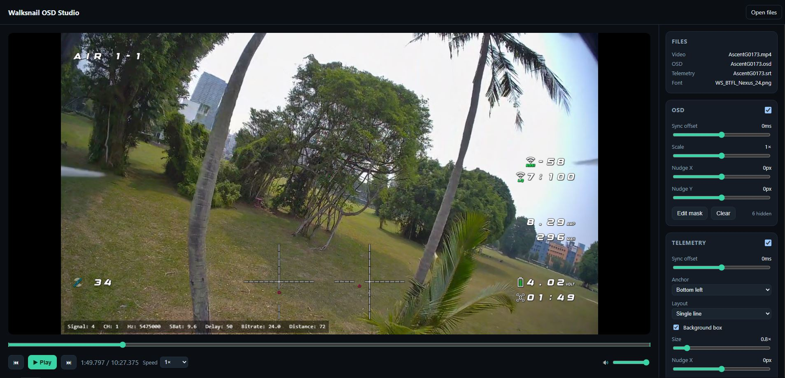

# Walksnail OSD Studio

A fully client-side, **offline** web app that combines a **Walksnail Avatar/Ascent DVR
video** with its recorded **`.osd`** overlay (from Betaflight / INAV) and
**`.srt`** link‑telemetry track, renders the composite in real time, and exports
a video with the OSD burned in.

Everything runs locally in your browser — your footage never leaves your device.



---

## Features

- **Pixel-accurate OSD overlay** reconstructed from the recorded `.osd` grid
  and a Walksnail/BF/INAV font atlas.
- **Link‑telemetry panel** from the `.srt` (signal, latency, bitrate,
  battery, distance, flight time…), with per-field selection.
- **100% local & offline** — no upload, no backend. Installable as a PWA.
- **Live overlay controls** — sync offset, position nudge, scale, a
  drag-to-hide **OSD element mask**, and drag-to-**move individual OSD cells**
  to any grid position.
- **Styleable telemetry** — single/multi-line layout, anchor corner,
  background box toggle, size and position.
- **Works without a video** — load just the `.osd`/`.srt` (+ font) to preview
  and export the overlay on its own over a chosen **background color**.
- **Trim & export** — dual-thumb range slider selects the segment to export;
  the overlay is burned in and downloaded as an MP4.
- **High-quality export** via [Mediabunny](https://mediabunny.dev) (WebCodecs,
  H.264, lossless audio copy), with a `MediaRecorder` fallback.

---

## Getting started

### Prerequisites

- [Node.js](https://nodejs.org/) **18+** (Node 20/22 recommended)
- A Chromium-based browser (Chrome/Edge) for the high-quality export path

### Setup

```bash
# 1. Clone the repository
git clone https://github.com/zqtay/walksnail-osd-studio.git
cd walksnail-osd-studio

# 2. Install dependencies
npm install

# 3. Start the dev server
npm run dev
```

Then open the printed local URL (typically `http://localhost:5173`).

### Available scripts

| Script | Description |
|--------|-------------|
| `npm run dev` | Start the Vite dev server |
| `npm run build` | Type-check and build the production PWA into `dist/` |
| `npm run preview` | Serve the production build locally |
| `npm test` | Run the unit test suite (Vitest) |
| `npm run test:watch` | Run tests in watch mode |
| `npm run typecheck` | Type-check without emitting |

---

## Usage

1. Launch the app and **drag & drop** (or use *Open files*) your capture set:
   - `.mp4` — the Walksnail DVR video (optional — the overlay works without it)
   - `.osd` — the OSD recording
   - `.srt` — the link-telemetry track
   - `.png` — an OSD font atlas (required to draw the OSD glyphs)
2. Files sharing a basename are **auto-paired** (e.g. `AscentG0177.*`).
3. Adjust the **OSD** and **Telemetry** panels to taste; use the sync offsets if
   the overlay leads/lags the footage.
   - In the **OSD** panel, **Mask cells** hides elements (e.g. the crosshair),
     and **Move cells** lets you drag individual glyphs to a new grid position.
   - The **Background** panel picks the color shown in place of the video and,
     when a video is loaded, toggles between the video and that color.
4. Set the **trim range** in the Export panel, then **Export clip** to download
   the burned-in MP4. Without a video, the overlay is exported over the
   background color; with a video, its audio is preserved either way.

> **Note:** The OSD/telemetry streams update at ~7 Hz (they are not one sample
> per video frame), so fast-changing values visibly “step”. This is inherent to
> the recording, not a rendering artifact.

---

## How it works

The app is fully client-side and organized around small, testable modules:

```
src/
├─ lib/
│  ├─ parsers/     # .osd binary, .srt telemetry, and font atlas decoders
│  ├─ engine/      # time/sync clock, deterministic canvas compositor
│  └─ export/      # Mediabunny (primary) + MediaRecorder (fallback) exporters
├─ hooks/          # useMediaLoader · usePlayer · useExporter
├─ components/     # video overlay, timeline, transport, sidebar panels
├─ state/          # persisted overlay settings
└─ styles/         # CSS modules by concern
```

- **`.osd`** — little-endian binary: a 40-byte header (`cols`/`rows` grid) then
  frames of `u32 timestamp_ms` + `cols*rows` u16 glyph indices. At video time
  `t`, the last frame with `timestamp ≤ t` is drawn (step/hold).
- **`.srt`** — standard SubRip whose payload is VRX link telemetry (not GPS),
  parsed into time-stamped field maps.
- **Overlay** — the same deterministic `drawOverlay` is used for both the live
  preview and the export, so the burned-in result matches what you see.

---

## Tech stack

- **Vite** + **React** + **TypeScript**
- **Canvas 2D** for overlay compositing
- **Mediabunny** (WebCodecs) for export, with a `MediaRecorder` fallback
- **vite-plugin-pwa** (Workbox) for offline/precache
- **Vitest** for unit tests

---

## Credits

- **[walksnail-osd-tool](https://github.com/avsaase/walksnail-osd-tool)** by
  avsaase — the original native tool and the inspiration for this project.
- **[sneaky_fpv](https://sites.google.com/view/sneaky-fpv/home)** — for the OSD
  font.
- **[Mediabunny](https://mediabunny.dev)** — the in-browser media/codec library
  powering the export pipeline.
- **Claude** (Anthropic) — for most of the development work.

---

## License

This project is provided as-is. See the repository for license details.
